[EMS-README (1).md](https://github.com/user-attachments/files/30327071/EMS-README.1.md)

  

---

**EMS Electric Billing System** is a billing application that calculates electricity bills based on the number of units consumed. It also generates a printable bill form, making the billing process simple, fast, and efficient.

## ⚡ Features

| | |
|---|---|
| 🔢 **Unit-Based Calculation** | Bill amount calculated directly from units consumed |
| 🧾 **Automatic Bill Generation** | Instantly generates a formatted bill on submission |
| 🖨️ **Printable Receipt** | One-click print of the generated bill form |
| 🎯 **Clean Interface** | Simple, distraction-free UI for fast data entry |
| ⚙️ **Fast & Accurate** | Calculations run instantly, no manual math needed |

## 🛠️ Tech Stack

- HTML
- CSS
- JavaScript
- C++ (backend logic)

## 📖 Usage

1. Enter customer details
2. Add the number of units consumed
3. Bill is generated automatically
4. Print the bill form if needed

## 🔮 Future Improvements

- [ ] Database integration
- [ ] Customer billing history
- [ ] PDF export
- [ ] Bill search feature
- [ ] Login system

## 📄 License

This project is for educational and personal use.

---

⚡ Built for learning, billed for real. ⚡

